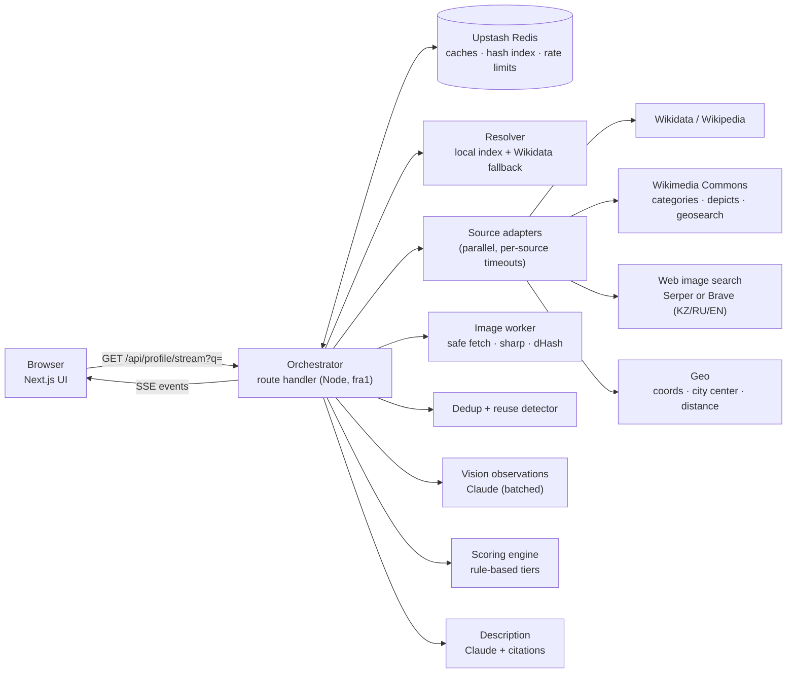
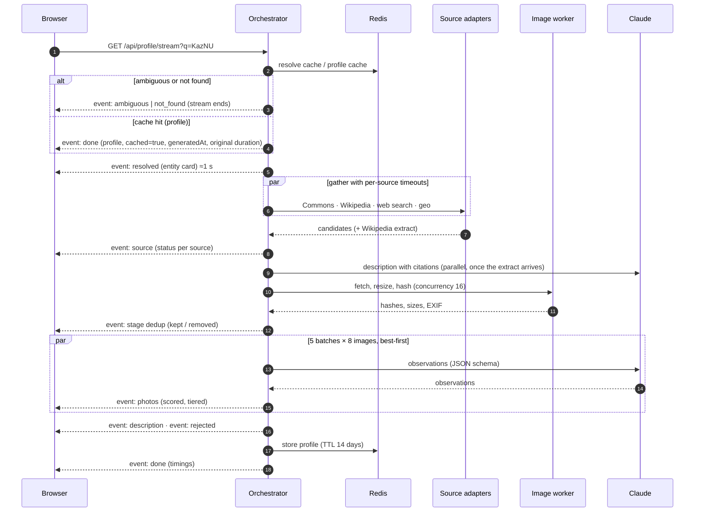

# Architecture — Case 01 "Visual University Profile"

> **Internal team document · LOCUS Startup Hackathon 2026 · written 16 Sep 2026**
> Strategy pack: [case-analysis](case-analysis.md) · [product-strategy](product-strategy.md) · **architecture** · [roadmap](roadmap.md)
>
> This is a direction-agnostic core with extension points for A/B/C (§15). **Nothing is implemented yet.** All thresholds, weights, and budgets are starting values to validate in the Day-0 spikes (§16) and to tune on the labeled set (§10).

---

> **⚠️ Update 17 Sep 2026 — FREE APIs only (team decision).** Paid Claude API is replaced everywhere below:
> - **Vision + description:** Google **Gemini API free tier** via `@google/genai` (`VISION_MODEL`, `DESCRIPTION_MODEL`; model chosen by spike S4, #22). Free quotas are per project and small → ≤3 vision requests per profile (batches of 12), caching via `lib/cache/kv.ts`, daily budget guard (#13). The description uses Gemini JSON output with validated source indices instead of Claude citations (#20).
> - **Terms:** the Gemini API account holder must be **18+**; free tier must not be offered to users in the **EEA/CH/UK** → `lib/pipeline/regions.ts` disables AI for those visitors; free-tier inputs may be used by Google to improve products → only public web photos are sent.
> - **Web images:** Serper (2,500 free credits, no card) + **Openverse** (free CC photos incl. Flickr, #33). Brave and Flickr API are dropped (card / paid Pro required). Cost model §14 no longer applies: running cost is $0.

## 0. TL;DR

- **One Next.js (TypeScript) app on Vercel**, Node.js runtime, function region **`fra1`** (Frankfurt). One repo, one deploy, no separate backend service.
- **The pipeline lives in one streaming route handler:** resolve → gather (parallel source adapters, per-source timeouts) → fetch & hash → deduplicate → vision observations → rule-based score → assemble. Results stream to the browser as **Server-Sent Events**, with a **27 s global deadline**.
- **Proof comes mostly from open data:** Wikidata, Wikipedia, Wikimedia Commons (categories, "depicts", GPS, dates, licenses). **Coverage comes from one web image search API** (Serper or Brave) queried in KZ/RU/EN.
- **AI reports observations; code decides.** A Claude vision model returns image type, category, visible text, consistency, and near-duplicate flags as JSON. A deterministic, unit-tested scoring function turns the evidence into tiers.
- **Upstash Redis** holds the caches, the reuse-detection hash index, and rate limits.
- **Every dependency can fail gracefully:** any source or the vision model can be down, and the profile still renders with an honest banner.
- **Cost:** ≈ **$0.05–0.25 per fresh profile**, depending on the vision model (§14). Cached views are free.

---

## 1. Stack

**Assumption:** at least two team members are comfortable with JavaScript/TypeScript and React. If the strongest developers are Python-only, see the alternative at the bottom of this section.

| Layer | Choice | Why | Rejected alternative |
|---|---|---|---|
| App framework | **Next.js (App Router) + TypeScript** | UI and API in one codebase and deploy; streaming route handlers; a huge ecosystem | Separate React SPA + FastAPI (two deploys, CORS, cold starts) |
| Hosting | **Vercel Hobby, Node.js runtime, region `fra1`** | Git-push deploys and previews. Fluid compute allows up to 300 s per function on Hobby (the pipeline needs ~30 s). Frankfurt is the closest Vercel region to Kazakhstan, with good links to Wikimedia and the API providers | Render/Railway/HF Spaces free tiers sleep, and cold starts would wreck the speed score |
| UI | **Tailwind CSS + shadcn/ui + lucide icons** | Fast, consistent design system; accessible primitives | Custom CSS from scratch |
| Contracts / validation | **Zod** + shared `lib/types.ts` | One schema for API payloads and model output validation | Unvalidated JSON |
| Streaming | **Server-Sent Events** from a `ReadableStream` | One-directional, simple, works through Vercel | WebSockets (unneeded complexity) |
| Image processing | **sharp** | Fast resize, EXIF rotation, raw pixels for perceptual hashing, metadata | Python PIL/imagehash (would force a Python service) |
| Vision + text model | **Claude API** via `@anthropic-ai/sdk` | Vision with multi-image requests, structured outputs, citations for grounded descriptions; model tier chosen by spike (§5.5) | Hard-wiring one vendor with no adapter |
| Web image search | **Serper** (no card needed) **or Brave Search API** (own index, card required), behind one adapter interface | See §2; pick tonight based on account access and a coverage spike | Google Custom Search (closed to new customers), Bing (retired) |
| Cache / KV | **Upstash Redis** (via Vercel Marketplace), region eu-central-1 | Serverless-friendly; profile/search/vision caches, hash index, rate limits (`@upstash/ratelimit`) | A relational DB (unneeded for a key-value workload) |
| Fuzzy search | **MiniSearch** (or Fuse.js) over a prebuilt JSON index | Typo-tolerant, in-process, milliseconds | A search service |
| Map (Direction B) | **Leaflet + react-leaflet**, OSM tiles with attribution, client-only dynamic import | Free, simple, no key | Google Maps (billing; Places ToS restrictions) |
| Tests | **Vitest** for scoring, hashing, URL canonicalization, resolver ranking | Cheap proof of code quality on the logic that matters | No tests |
| CI | **GitHub Actions**: typecheck + lint + unit tests on PRs | ~15 minutes to set up; visible engineering discipline | — |
| Logging | Structured JSON logs per request (request id, stage timings, source status, token usage) → Vercel logs | Debug speed issues; source for benchmark numbers | — |

**Python alternative (only if necessary):** a FastAPI backend (pipeline, imagehash, optional open_clip) on an always-on paid instance, plus a Next.js frontend on Vercel. It adds a second deploy and CORS, and free Python hosts sleep. Don't use a sleeping free tier: a cold start during judging costs the speed criterion.

---

## 2. External services: verified status

Checked on **16 Sep 2026**. Re-verify pricing and limits when creating accounts.

| Service | Our use | Status / limits | Implication |
|---|---|---|---|
| **Wikimedia APIs** (Commons, Wikidata, Wikipedia) | Entity data, photos with provenance, descriptions | **New global limits in 2026:** ~**10 req/min** for requests with no identifying User-Agent; **200 req/min** for unauthenticated clients with a compliant User-Agent; authenticated new accounts 200 req/min; HTTP 429 with `Retry-After`. The limits are described as experimental and may change ([source](https://www.mediawiki.org/wiki/Wikimedia_APIs/Rate_limits)) | Always send a UA like `CampusProof/0.1 (https://github.com/<team>/<repo>; <contact email>)`. Batch requests, cache 24 h, honor `Retry-After`, keep to ≤15 calls per profile. Never call Wikimedia APIs without the UA |
| **Google Custom Search JSON API** | — | **Closed to new customers**; discontinuation announced for 1 Jan 2027 ([source](https://developers.google.com/custom-search/v1/overview)) | Do not use |
| **Bing Web/Image Search API** | — | Retired in August 2025 | Do not use |
| **Serper.dev** (search-engine results API) | Web image search | **2,500 free queries, no credit card**; images endpoint = 1 credit per ≤10 results; paid packs from $50 / 50k credits ([source](https://serper.dev/)) | Default if nobody can add a card. Disclose in the README. It returns search-engine results, so provenance comes from the linked pages, not the provider |
| **Brave Search API** | Web image search (alternative) | Reported: free plan removed Feb 2026; ~$5 of monthly credits (~1k queries); **card required; no default spending cap** ([third-party report](https://agentdeals.dev/vendor/brave-search-api)) | Cleaner provenance story (own index, official API). Set usage alerts if used |
| **Claude API** (Anthropic) | Vision observations; grounded description | Per MTok input/output: **Haiku 4.5 $1/$5**, **Sonnet 5 $2/$10**, **Opus 5 $5/$25**. Image tokens = ⌈width/28⌉ × ⌈height/28⌉ (640×480 → 414 tokens). Up to **100 images/request** on 200k-context models (Haiku 4.5), 600 on others; if a request has >20 images, each must be ≤2000 px. Images via base64, URL, or Files API. **The docs state the model can't reliably determine whether an image is AI-generated.** Standard tier limits: 1,000 RPM, 2M ITPM, 400k OTPM per model; new organizations may start on a lower evaluation tier. Prepaid credits required ([vision](https://platform.claude.com/docs/en/build-with-claude/vision), [rate limits](https://platform.claude.com/docs/en/api/rate-limits)) | Downscale images to ~640 px; batch 8 images per call; set a console spend limit; choose the model with the spike |
| **Gemini API** (fallback adapter only) | Vision (alternative) | Reported: free tier on Flash / Flash-Lite with roughly 10–15 RPM ([third-party report](https://pecollective.com/tools/gemini-free-tier-guide/)) | A free tier at ~10 RPM can't serve concurrent judges (one profile ≈ 5–6 calls). Viable only on a paid tier |
| **Vercel Hobby** | Hosting | Fluid compute max duration **300 s** ([source](https://vercel.com/docs/functions/configuring-functions/duration)) | Enough for a 27 s pipeline with headroom |
| **OSM Nominatim** | Geocoding fallback only | Usage policy: max ~1 req/s, identifying UA, caching expected | Use only when Wikidata has no coordinates; cache results |
| **OSM tiles** | Map background (B) | Light use allowed with attribution | Fine for hackathon traffic |
| **Open-Meteo** | Climate card (C only) | Free for non-commercial use, no key | Only if C |

**Billing reality:** paid API accounts usually need an adult account holder with a payment method. If team members are under 18, a parent or mentor should own the billing accounts. Set spend limits everywhere.

---

## 3. System overview



---

## 4. Request lifecycle and streaming protocol



**Event types** (SSE `event:` name + JSON `data:`):

```ts
type StreamEvent =
  | { type: 'resolved'; entity: UniversityEntity }
  | { type: 'ambiguous'; candidates: CandidateCard[] }
  | { type: 'not_found'; query: string; suggestions: CandidateCard[] }
  | { type: 'source'; status: SourceStatus }
  | { type: 'stage'; stage: 'gather' | 'fetch' | 'dedup' | 'verify' | 'assemble';
      status: 'start' | 'done'; counts?: Record<string, number>; ms: number }
  | { type: 'photos'; photos: Photo[] }            // streamed per verification batch
  | { type: 'rejected'; items: RejectedItem[] }
  | { type: 'description'; description: Description | null }
  | { type: 'done'; profile: UniversityProfile; cached: boolean }
  | { type: 'error'; code: string; message: string; retryable: boolean };
```

**Client rules:**
- The timer starts when the user presses Enter.
- The UI renders incrementally. If the stream breaks, the client fetches `GET /api/profile/{qid}` (the cached final JSON) as a fallback.
- On disconnect, the server aborts in-flight work (`AbortController`) to save credits.

**Routes:**

| Route | Purpose |
|---|---|
| `GET /api/resolve?q=` | Resolver only (typeahead / pick-list) |
| `GET /api/profile/stream?q=` or `?qid=` | Streaming pipeline. Options: `refresh=1` (bypass cache, rate-limited), `simulate=web_search_down\|vision_down\|wikimedia_down` (documented fault injection; never cached) |
| `GET /api/profile/{qid}` | Cached final profile JSON (permalinks, compare, fallback) |
| `GET /api/health` | Cheap reachability check for each provider (used before demos) |
| `POST /api/flag` | Report a photo (nice-to-have) |
| Pages | `/` home · `/u/[qid]` profile permalink · `/how-it-works` · `/benchmark` (B) · `/compare` (B stretch) |

---

## 5. Pipeline stages

### 5.0 Time budget

| Stage | Target p50 | Hard cap | Streams |
|---|---|---|---|
| Cache + resolve | 0.3–1.0 s | 4 s | `resolved` / `ambiguous` / `not_found` |
| Gather (parallel adapters) | 2–4 s | 7 s per adapter | `source` |
| Pre-filter, fetch, hash | 2–3 s | 3 s per image; 6 s for the stage | `stage` |
| Dedup + reuse check | <0.3 s | — | `stage` |
| Vision observations (parallel batches) | 5–8 s | 12 s | `photos` per batch |
| Score + assemble (description runs in parallel from gather) | <0.5 s | — | `description`, `rejected`, `done` |
| **Total** | **~12–18 s** | **27 s global deadline** | — |

The resolve cap covers the slowest path, a misspelled query: prefix + full-text search, `wbgetentities`,
the fuzzy suggestion search, `wbgetentities` again and place labels — five sequential Wikidata round trips,
measured at 2.0–2.4 s. At 2.5 s "Harvrad" answered with an error instead of offering Harvard. The
orchestrator wraps `resolveQuery` with one extra `STAGE_GRACE_MS`, so the resolver's own graceful
"not_found without suggestions" always wins the race against the hard abort.

**Service-level targets:** entity card ≤2 s · first photos ≤10 s · complete profile ≤20 s at p50 and ≤27 s at p90.

**Deadline rule:** at T+27 s the orchestrator finalizes with whatever is done. Images still waiting for vision are scored without visual observations (they can't reach Verified unless they have strong non-visual evidence), and they get the reason `verification_timeout` if they drop below the display threshold.

### 5.1 Resolve

**Offline index** (`scripts/build-index.ts`, output `data/universities.min.json`, committed):
- **Source 1: Wikidata SPARQL.** Items that are instances of (subclasses of) *higher education institution* (Q38723, which covers university Q3918). Fields: labels + aliases in `en`/`ru`/`kk`, short name (P1813), country (P17), located in (P131) → city, coordinates (P625), official website (P856), Commons category (P373), logo (P154), image (P18), inception (P571), student count (P2196), sitelink count (popularity).
  - Scope: all of Kazakhstan and Central Asia, plus worldwide items above a popularity threshold.
  - **Chunk queries by country** to stay under the query service timeout.
- **Source 2: the open university-domains list (Hipo, MIT license)** adds official domains; merge by normalized name + country.
- **City records:** name, QID, coordinates, Commons category (for city photos and distance to center).

**Online resolution:**
1. **Normalize the query:** NFKC, lowercase, fold diacritics and Kazakh-specific letters (ә ғ қ ң ө ұ ү һ і), strip punctuation and filler words (университет, university, univer, uni), and generate a Cyrillic↔Latin transliteration variant. Reject empty queries or queries longer than 120 characters.
2. **Fuzzy search** over names, aliases, and short names with MiniSearch, boosted by popularity.
3. **Fallback to Wikidata** `wbsearchentities` (en + ru) if there's no good hit, filtered to higher-education items.
4. **Decision:**
   - **Auto-select** when top score ≥ T and gap to #2 ≥ M.
   - **`ambiguous`** with up to 6 candidate cards (name, city, country, founded, logo) when several candidates are close.
   - **`not_found`** with closest suggestions otherwise. If the query matches a *city*, suggest universities in that city.
5. **Cache** `resolve:{normalizedQuery}` for 7 days.

### 5.2 Gather: source adapters

```ts
interface SourceAdapter {
  id: 'commons' | 'wikipedia' | 'web_search' | 'geo' | string;
  timeoutMs: number;
  gather(entity: UniversityEntity, ctx: RunContext): Promise<Candidate[]>; // must respect ctx.signal
}

interface Candidate {
  imageUrl: string; thumbUrl?: string; sourcePageUrl: string; sourceDomain: string;
  provider: string; title?: string; caption?: string;
  categoryHint?: CategoryId;               // from the query template or Commons subcategory keywords
  provenance: {
    commonsCategoryMatch?: boolean; depictsQid?: boolean; usedOnWikipedia?: boolean;
    officialDomain?: boolean; pageMentionsName?: boolean; sourceType: SourceType;
  };
  geo?: { lat: number; lon: number };
  date?: { value: string; kind: DateKind };
  license?: { name: string; url?: string; author?: string };
  width?: number; height?: number;
}
```

**Commons adapter** (≤8 API calls, batched with `generator=` + `prop=imageinfo|coordinates`, `iiprop=url|size|mime|extmetadata`, standard thumbnail widths such as 500/960 px):
- a) **Category tree:** files in `Category:<P373>`, plus up to 4 relevant subcategories (depth ≤2, cap ~150 files). Subcategory names map to category hints via keywords, e.g. `librar|библиотек` → library, `dormitor|residence hall|hostel|общежит|жатақхана` → dormitory, `sport|stadium|gym|спорт` → sports, `laborator|лаборатор` → lab, `auditor|lecture|classroom|аудитор` → classroom.
- b) **Depicts:** file search `haswbstatement:P180=<QID>`.
- c) **Geosearch:** files within 1,000 m of the campus coordinates (`generator=geosearch`, namespace 6).
- d) **City:** the city's Commons category (quality-first, cap ~30) or geosearch around the city center.
- **Parse from `extmetadata`:** `DateTimeOriginal` / `DateTime`, `LicenseShortName` / `LicenseUrl`, `Artist` and `ImageDescription` (**strip HTML**), `Categories`, `GPSLatitude` / `GPSLongitude`.
- **Pre-reject by filename/category keywords:** logo, coat of arms, seal, map, plan, diagram, signature, document, portrait.

**Wikipedia adapter:** page summary (extract + URL) in ru/en/kk via sitelinks, plus a flag for images used on the article.

**Web image search adapter** (Serper or Brave):
- **Query plan:** ≤8 queries per profile, prioritized by weak categories after Commons, with templates per category and language. For example: `"{name_en}" campus`, `"{name_ru}" общежитие`, `"{name_en}" library`, `"{name_ru}" лаборатория`, `"{name_ru}" спорткомплекс`, `"{name_ru}" студенты`, `site:{officialDomain} кампус`. Locale: country code + `ru`/`en`.
- **`pageMentionsName`:** the title, URL, or domain contains a normalized name or alias (in either script).
- **Domain classification** (`lib/config/domains.ts`):

  | Class | Examples / rule | Handling |
  |---|---|---|
  | official | Index domains (e.g. `*.edu.kz` from Wikidata / Hipo) | Provenance signal |
  | encyclopedic | Wikimedia | Provenance signal |
  | news | Curated news/media list | Provenance signal |
  | social | Instagram, Facebook, VK, TikTok | Often unfetchable |
  | aggregator | Pinterest-like sites | Penalty |
  | stock | shutterstock, istockphoto, gettyimages, depositphotos, dreamstime, alamy, 123rf, freepik, pexels, unsplash, pixabay, adobe stock, vecteezy | **Reject** |
  | independent | Everything else | — |

- **Cache** `search:{provider}:{hash(query+locale)}` for 72 h. This saves free credits during development.

**Geo adapter:** campus coordinates from the index (fallback: Nominatim, cached, 1 req/s). City-center coordinates from the city entity. Haversine distance, labeled "straight-line".

### 5.3 Pre-filter, fetch, hash

1. **Canonicalize URLs:** lowercase host; strip tracking params; map Commons thumb paths to the file key; strip size suffixes (`-1024x768`, `_thumb`, `?w=`). Drop exact duplicates.
2. **Pre-reject:** non-image MIME types, SVG/GIF, known junk patterns, stock domains (keep them as reuse evidence, §5.4).
3. **Rank for the vision budget** by a cheap prior (provenance hints, source type, resolution, category diversity). Keep the top **K = 40** with per-category quotas so every required area gets candidates.
4. **Safe fetch** (SSRF-safe):
   - http/https only; no IP-literal or private-range hosts;
   - ≤3 redirects, ≤5 MB, 3 s timeout, `content-type: image/*`;
   - concurrency 16.
   Prefer the original image. On failure, fall back to the provider thumbnail and flag `lowResVerification`.
5. **sharp:** apply EXIF rotation, resize to **640 px on the long edge** for vision input, and compute a **64-bit dHash** (9×8 grayscale). Read dimensions and EXIF date/GPS when present. Reject if the short side is <300 px, unless provenance is strong.

### 5.4 Deduplication and reuse detection

| Level | Catches | Method | Starting threshold |
|---|---|---|---|
| L1 exact | Same file at different URLs | Canonical URL / Commons file key / byte hash | Exact |
| L2 near-identical | Resized, recompressed, lightly cropped copies | dHash Hamming distance, all pairs in run (~40–80 images → trivial) | ≤6 bits (tune 4–10 on labels) |
| L3 visually similar | Same scene from nearly the same viewpoint | Vision model returns `near_duplicate_of` within a batch; batches grouped by category hint so similar shots co-occur | Model judgement |
| L3+ (optional) | Similar shots across batches | Multimodal embeddings API + cosine similarity, only if a Day-2 spike finds a fast, affordable provider | cos ≥ τ (tune) |

**Cluster representative:** keep the photo with the highest (provenance strength, resolution, has date/license). The others become `alsoFoundAt[]`, and every extra source that shows the same image also counts as cross-source agreement.

**Reuse detector** (Direction B):
- **Persistent index.** The 64-bit dHash is split into **4 × 16-bit bands**. Redis sets `hb:{band}:{value}` → image ids, plus `img:{id}` → {full hash, domain, qid, pageUrl}. A lookup reads 4 sets and checks Hamming distance on the candidates, which is guaranteed to find copies within ≤3 bits (typical for re-uploads).
- **Rules:**
  - Matches an image seen on a **stock domain** → **reject** (`stock_reuse`).
  - Matches images attributed to **≥2 other universities** → **reject** (`reused_across_universities`); **1 other** → penalty.
- **Index writes:** every candidate hash at the end of each run (including stock-domain hits from web search).

### 5.5 Visual verification

**Principle:** the model reports *observations*. It never outputs the confidence number, and it never identifies people.

**Request shape** (one call per batch of ≤8 images; 5 batches in parallel; best-prior batches first):
- **System prompt** (static): role, category definitions (§6), observation rules ("report what is visible; answer `unclear` when unsure; do not identify people"), output schema.
- **User content:** a university context block (official names in en/ru/kk, aliases, city, country, notable building/subcategory names from Commons, ≤600-character Wikipedia extract). Then per image: `Image img_17:` → image (base64 JPEG, ~640 px) → one metadata line (source domain, page title, caption/alt, category hint).

**Output schema** (validated with Zod; one object per image):

```json
{
  "id": "img_17",
  "image_type": "photo | render_or_illustration | logo_or_emblem | map_or_plan | document_or_screenshot | collage | other",
  "stock_like": false,
  "watermark_text": null,
  "primary_category": "campus | dormitory | classroom | library | lab | sports | student_life | city | other",
  "secondary_categories": [],
  "visible_text": "verbatim signage/logo text, ≤80 chars, or empty",
  "names_institution": "this | other | none | unclear",
  "other_institution_name": null,
  "scene_consistent_with_context": "consistent | inconsistent | unclear",
  "close_up_portrait": false,
  "near_duplicate_of": null,
  "quality": 3,
  "reason": "≤20 words"
}
```

**Model choice (decided by the Day-0 spike, §16):**
- **Candidates:**
  - `claude-opus-5`: vendor default and most capable; for latency, use lower `effort` rather than disabling thinking.
  - `claude-sonnet-5`: adaptive thinking is on by default, so test with thinking disabled or low effort.
  - `claude-haiku-4-5`: fastest and cheapest; no thinking by default.
- **Measure on the same labeled batches:** category accuracy, trap detection (stock/render/logo/other university), `names_institution` correctness, p50/p90 latency per 8-image batch, and cost per profile.
- **Rule:** choose the most accurate model whose p90 batch latency is ≤8 s. This is a team decision based on measurements.
- **Structured output:** use JSON-schema structured outputs if the chosen model supports them (check the Models API capabilities). Otherwise use a strict tool schema, Zod validation, and one retry.

**Failure handling:**
- **Invalid JSON or API error:** retry once with the batch halved.
- **Still failing:** mark the images `vision_unavailable`. Scoring then runs on non-visual evidence only (§5.6), and the UI shows a degraded banner.

**Known limits** (state them in the README):
- The model can misread small or distant text.
- The vendor states the model can't reliably detect AI-generated images; we don't claim that capability.
- "Consistent with context" is a weak signal.

### 5.6 Confidence scoring

A pure function `score(candidate, observations, context) → { points, tier, evidence[] }`, unit-tested with fixtures.

| Signal | Kind | Points | Strength |
|---|---|---|---|
| Commons "depicts" = university QID | provenance | +45 | strong |
| In the university's Commons category tree (depth ≤2) | provenance | +40 | strong |
| Geotag ≤1.5 km from campus | geo | +35 | strong |
| Used in the university's Wikipedia article | provenance | +30 | strong |
| Found on the official domain | provenance | +30 (+10 if `stock_like` or render) | strong* |
| Visible text names **this** institution | visual text | +30 | strong |
| Page title / URL / caption mentions name or alias | text | +15 | medium |
| Same image found on another independent source that names the university | cross-source | +15 | medium |
| Found on a news/media page that names the university | provenance | +10 | medium |
| Visual scene consistent with context | visual | +10 | weak |
| Geotag in the same city (≤30 km) | geo | +10 (campus categories) / +35 (city) | medium |
| Visual scene inconsistent | visual | −25 | negative |
| Render / illustration | visual | −40, labeled "render" | negative |
| Reused by 1 other university | cross-source | −30 | negative |
| Only a low-res thumbnail was verified | quality | −10 | — |
| Reported by users (≥2 reports) | community | −30 | negative |
| Geotag >50 km away (campus categories) | geo | **hard reject** `far_geotag` | — |
| Visible text names **another** institution | visual text | **hard reject** `other_institution` | — |
| Stock domain / stock reuse / reused by ≥2 other universities | provenance | **hard reject** | — |
| Not a photo (logo, map, document, screenshot) | visual | **hard reject** `not_a_photo` | — |
| Close-up portrait of an individual | privacy | **excluded** `portrait` | — |

**Tiers (starting values):**

| Tier | Rule | Display |
|---|---|---|
| **Verified** | ≥60 points **and** ≥1 strong signal **and** no negative visual signal | Shown by default |
| **Likely** | 35–59 points, or ≥60 without a strong signal | Shown by default, labeled |
| **Unconfirmed** | 10–34 points | Hidden behind a "show unconfirmed" toggle, with a warning |
| **Rejected** | <10 points, or any hard reject | Filtered-out section, with reason |

- **City category:** uses city-specific rules (geotag within the city, the city's Commons category, visible landmarks consistent with the city).
- **Degraded mode** (`vision_unavailable`): images can still reach Verified on strong provenance/geo evidence, but carry the label "visual check unavailable". Web-search-only images cap at Unconfirmed.
- **In the UI:** the tier plus evidence lines; points appear only in details, with the note "evidence points, not a probability".
- **Calibration:** tune weights and thresholds on the *tune* split only; report metrics on the *test* split (§10).

### 5.7 Assembly, description, facts

- **Order photos** per category by tier → points → quality. Show 12 per category plus "show more".
- **Coverage** per category: counts by tier → `good` (≥3 verified+likely) / `thin` (1–2) / `none` (0).
- **Description:**
  - **Inputs:** Wikipedia extract(s) (ru/en), Wikidata facts, and the official site's meta description if already fetched.
  - **Generation:** Claude with the sources passed as **document blocks with citations enabled**, so every sentence carries cited spans. Render footnote markers that link to source URLs.
  - **Constraints:** citations can't be combined with structured-output formatting, so this call returns plain text. Prompt: "3–5 sentences for applicants, only from the provided documents; if they lack campus information, say so."
  - **Fallback:** the first 2–3 sentences of the Wikipedia extract, quoted and linked.
- **Facts panel** from Wikidata (founded, students, type, city, website), each with a source link.
- **Distance** from campus to city center (straight-line) when both coordinates exist.

---

## 6. Category taxonomy

`lib/config/categories.ts` holds everything below, so adding a category means adding a config entry.

| id | UI label (RU, from the case) | EN | Definition for the model | Required? |
|---|---|---|---|---|
| `campus` | Кампус | Campus | Exterior of university buildings, grounds, entrances, aerial views | Required area |
| `dormitory` | Общежития | Dormitories | Student housing: exterior or rooms/common areas | Required area + **filter** "общежитие" |
| `classroom` | Аудитории | Classrooms | Lecture halls, classrooms, seminar rooms | Required area |
| `library` | Библиотеки | Libraries | Library interior/exterior, reading rooms | Required area |
| `city` | Город | City | The city where the university is located: skyline, streets, landmarks | Required area |
| `sports` | Спорт | Sports | Gyms, stadiums, pools, sports halls, fields | **Filter** "спорт" |
| `lab` | Лаборатории | Labs | Laboratories, makerspaces, computer labs, research equipment | **Filter** "лаборатории" |
| `student_life` | Студенческая жизнь | Student life | Events, clubs, cafeterias, students on campus (no close-up portraits) | **Filter** "студенческая жизнь" |

Each entry also carries query templates (en/ru/kk) and Commons keyword hints.

---

## 7. Data contracts

`lib/types.ts`. Freeze v1 at Checkpoint 0 so frontend and backend can work in parallel against fixtures.

```ts
export type CategoryId =
  | 'campus' | 'dormitory' | 'classroom' | 'library' | 'city' | 'sports' | 'lab' | 'student_life';
export type Tier = 'verified' | 'likely' | 'unconfirmed' | 'rejected';
export type SourceType = 'official' | 'encyclopedic' | 'news' | 'independent' | 'social' | 'unknown';
export type DateKind = 'taken' | 'uploaded' | 'published' | 'retrieved';

export interface UniversityEntity {
  qid: string;
  name: string;
  names: { en?: string; ru?: string; kk?: string };
  aliases: string[];
  country: string; countryCode: string;
  city?: { name: string; qid?: string; lat?: number; lon?: number };
  coords?: { lat: number; lon: number };
  website?: string; domains: string[];
  commonsCategory?: string;
  wikipedia: { lang: string; title: string; url: string }[];
  logoUrl?: string;
}

export interface CandidateCard {
  qid: string; name: string; city?: string; country: string; founded?: string; logoUrl?: string;
}

export interface Evidence {
  signal: string;                       // e.g. 'commons_category', 'geo_near_campus'
  kind: 'provenance' | 'geo' | 'visual' | 'text' | 'cross_source' | 'quality' | 'community';
  points: number;
  label: string;                        // plain language, shown in the evidence card
}

export interface Photo {
  id: string;                           // hash of canonical URL
  imageUrl: string; thumbUrl: string; width?: number; height?: number;
  sourcePageUrl: string; sourceDomain: string; sourceType: SourceType; provider: string;
  title?: string;
  date?: { value: string; kind: DateKind };
  retrievedAt: string;                  // ISO; always present
  license?: { name: string; url?: string; author?: string };
  geo?: { lat: number; lon: number; distanceToCampusM?: number };
  category: CategoryId; secondary: CategoryId[];
  tier: Exclude<Tier, 'rejected'>; points: number; evidence: Evidence[];
  labels: ('render' | 'possibly_outdated' | 'visual_check_unavailable' | 'low_res_verification')[];
  alsoFoundAt: { sourcePageUrl: string; sourceDomain: string }[];
  dHash: string;
}

export type RejectReason =
  | 'duplicate' | 'not_a_photo' | 'stock_source' | 'stock_reuse' | 'reused_across_universities'
  | 'render' | 'other_institution' | 'far_geotag' | 'low_quality' | 'portrait'
  | 'fetch_failed' | 'verification_timeout' | 'low_score';

export interface RejectedItem {
  thumbUrl?: string;                    // omitted for portraits/unsafe
  sourcePageUrl: string; reason: RejectReason; detail: string; duplicateOf?: string;
}

export interface SourceStatus {
  source: string;
  status: 'ok' | 'partial' | 'timeout' | 'error' | 'skipped' | 'simulated_down';
  candidates: number; ms: number; note?: string;
}

export interface Description {
  text: string;                         // with [n] markers
  citations: { n: number; url: string; title: string; quote?: string }[];
}

export interface UniversityProfile {
  pipelineVersion: string;
  entity: UniversityEntity;
  facts: { label: string; value: string; sourceUrl: string }[];
  description: Description | null;
  photos: Photo[];                      // verified + likely + unconfirmed; UI filters by tier
  rejected: RejectedItem[];
  coverage: Record<CategoryId, { verified: number; likely: number; unconfirmed: number;
                                 status: 'good' | 'thin' | 'none' }>;
  sources: SourceStatus[];
  distanceToCityCenterM?: number;
  degraded: ('web_search_unavailable' | 'vision_unavailable' | 'wikimedia_unavailable')[];
  timings: { totalMs: number; firstPhotoMs?: number; stages: Record<string, number> };
  generatedAt: string;
}
```

---

## 8. Caching, budgets, and degraded modes

### 8.1 Cache keys

| Key | Content | TTL |
|---|---|---|
| `profile:{pipelineVersion}:{qid}` | Final profile JSON | **14 days** (must survive until 25 Sep) |
| `resolve:{normalizedQuery}` | Resolver result | 7 days |
| `wm:{hash(url)}` | Wikimedia API responses | 24 h |
| `search:{provider}:{hash(query+locale)}` | Search results | 72 h |
| `vision:{model}:{dHash}:{qid}` | Vision observations | 14 days |
| `hb:{band}:{value}`, `img:{id}` | Reuse hash index | No TTL |
| `rl:*` | Rate-limit counters | Window |
| `flag:{dHash}` | User reports | No TTL |

- **Cache hit UX:** "Saved profile · generated 18 Sep 14:02 in 16.4 s · **Refresh live**".
- **Versioning:** bumping `pipelineVersion` after a pipeline fix invalidates stale profiles. (Remember that after the deadline no changes are allowed.)

### 8.2 Budgets and rate limits

- **Per fresh profile:** ≤8 search queries, ≤40 vision images (≤6 calls), 1 description call, ≤15 Wikimedia calls.
- **Global daily guard:** env `MAX_FRESH_PROFILES_PER_DAY`. Past the limit, serve cached profiles or degraded mode, with a banner.
- **Per-IP rate limit on fresh generations:** generous (e.g. 20 per 10 min) so judges sharing one network aren't blocked. Cached views are unlimited.
- **Provider-side caps:** Anthropic console spend limit; Serper credit monitoring; Brave usage alerts if used.

### 8.3 Degraded modes

| Failure | Behavior | Banner |
|---|---|---|
| Web search down, over quota, or simulated | Commons/Wikipedia only | "Web search is unavailable. Showing encyclopedic sources only; coverage may be lower." |
| Vision API down, rate-limited, or simulated | Score on non-visual evidence; web-only images cap at Unconfirmed | "Visual checks are temporarily unavailable. Only source-verified photos are marked Verified." |
| Wikimedia 429/down or simulated | Web search + official domain; index coordinates still used | "Wikimedia is unavailable. Fewer photos can be verified." |
| Redis down | Run without cache or rate limits (log it) | None |
| Everything fails | Error state with retry and links to any cached profiles | "We couldn't reach our sources. Try again in a minute." |

**Fault injection:** `?simulate=` is documented in the README's judge test scenario, bypasses the cache, and is never cached.

---

## 9. Security measures

(Also required for the README technical reference.)

- **Secrets:** API keys live only in Vercel environment variables. Commit only `.env.example`, keep `.env*` in `.gitignore`, and scan history before making the repo public. No secret uses the `NEXT_PUBLIC_` prefix.
- **Server-side only:** all third-party API calls happen server-side; the client never sees keys.
- **SSRF-safe image fetching:** protocol allowlist, private/IP-literal host block, redirect/size/time caps, content-type check (§5.3).
- **Untrusted content:** HTML from sources (Commons `Artist`/`ImageDescription`, page titles) becomes plain text. Never `dangerouslySetInnerHTML` for source content.
- **Input validation:** Zod on every route: query ≤120 characters, control characters stripped, enums for `simulate`.
- **Abuse and spend:** per-IP rate limits, a global daily guard, provider spend limits.
- **Images:** `` with an error fallback. Full-size images are never re-hosted; attribution and license are shown when known.
- **Privacy:** no accounts; no personal data stored; logs without raw IPs (hash if needed); close-up portraits excluded; the model is never asked to identify people.
- **Dependencies:** lockfile committed; `npm audit` before submission.

---

## 10. Evaluation harness

- **Labeled set:** ~12 universities (6 Kazakhstan/Central Asia, 6 international; mix of rich and sparse data). For each, sample ~20–25 candidates **before filtering**, so negatives are included.
  - **Labels:** belongs (yes/no/unsure), true category, duplicate of, stock/render.
  - **Storage:** `eval/labels/*.json`.
  - **Split:** tune (6 universities) / test (6 universities).
- **Labeling tool:** a script generates a static HTML contact sheet with checkboxes that exports JSON, or a hidden dev-only page disabled in production. Budget ~3 h for P4.
- **Metrics:**

  | Metric | Target |
  |---|---|
  | Precision of Verified | ≥90% |
  | Precision of Verified+Likely | ≥80% |
  | Category accuracy on correct photos | ≥85% |
  | Visible duplicate leakage | 0 per profile |
  | False-reject rate | Reported |
  | Cold-run latency p50 / p90 | ≤20 s / ≤27 s |
  | Cost per profile | Reported |

- **Scripts:**
  - `npm run eval` runs the pipeline on the set with cache bypass and writes `eval/results/<date>.json` plus a markdown table.
  - `npm run bench` runs ~20 cold queries and writes latency percentiles.
- **Integrity:** labels are never read at runtime; numbers in the README and slides must come from these files, with sample sizes.

---

## 11. Repository layout

```
/app
  page.tsx                          # home / search
  u/[qid]/page.tsx                  # profile permalink (streams or loads cached)
  how-it-works/page.tsx
  benchmark/page.tsx                # B
  compare/page.tsx                  # B stretch
  api/resolve/route.ts
  api/profile/stream/route.ts       # SSE orchestrator (runtime: nodejs)
  api/profile/[qid]/route.ts
  api/health/route.ts
  api/flag/route.ts                 # nice-to-have
/components                         # SearchBox, PickList, ProfileHeader, PipelineRail, SourceChips,
                                    # FilterBar, CategorySection, PhotoCard, EvidenceDialog,
                                    # CoveragePanel, FilteredOutTray, DegradedBanner, MapView
/lib
  types.ts
  pipeline/orchestrator.ts  pipeline/deadline.ts  pipeline/events.ts
  resolver/normalize.ts  resolver/search.ts  resolver/wikidata.ts
  sources/commons.ts  sources/wikipedia.ts  sources/geo.ts
  sources/webSearch/index.ts  sources/webSearch/serper.ts  sources/webSearch/brave.ts
  images/safeFetch.ts  images/canonicalize.ts  images/dhash.ts  images/dedup.ts  images/reuse.ts
  vision/provider.ts  vision/claude.ts  vision/prompt.ts  vision/schema.ts
  scoring/signals.ts  scoring/score.ts  scoring/tiers.ts
  describe/description.ts
  config/categories.ts  config/domains.ts  config/limits.ts
  cache/redis.ts  cache/ratelimit.ts
/data/universities.min.json
/scripts/build-index.ts  scripts/eval.ts  scripts/bench.ts  scripts/label-sheet.ts
/eval/labels  /eval/results
/tests/*.test.ts                    # scoring, dhash, canonicalize, normalize, resolver ranking
/docs/*.md
.env.example  README.md
```

---

## 12. Automation

| What | How | Owner |
|---|---|---|
| Deploys | GitHub → Vercel: `main` = production, PRs = preview URLs | P1 |
| Quality gate | GitHub Actions on PR: `tsc --noEmit`, lint, Vitest | P1 |
| University index | `npm run build:index` (re-runnable; committed output) | P1 |
| Accuracy and latency numbers | `npm run eval`, `npm run bench` → committed results → README / `/benchmark` | P2 |
| Health check | `GET /api/health` before every demo and twice daily during 19–25 Sep | P4 |
| Spend monitoring | Anthropic console spend limit + usage page; Serper dashboard; Upstash dashboard | P4 |
| Post-deadline freeze | Tag `v1.0-submission`; protect `main` / disable auto-deploy so nothing changes the evaluated version | P1 |

---

## 13. Scalability path

- **New university:** zero code. The resolver index plus the live Wikidata fallback cover it; `build-index` can be re-run per country.
- **New source:** implement `SourceAdapter` and classify its domains. Candidates automatically flow through dedup, verification, and scoring. Future candidates:
  - Flickr (geotags + licenses);
  - street-level imagery (Mapillary, CC BY-SA);
  - official-site sitemaps;
  - Google Places photos (strong place binding, but billing and display-terms constraints);
  - regional directory/map services via partnership.
- **New category:** add a config entry (labels, definition, query templates, keyword hints). The prompt and UI pick it up.
- **Throughput:** stateless functions and Redis caches. The reuse index gets *more* valuable with volume. Popular universities can be pre-indexed offline with the Message Batches API (asynchronous, lower cost), with results labeled by generation date.
- **Product:** a JSON profile API and an embeddable widget for education platforms; multilingual UI; community verification.
- **Multi-campus:** OSM campus polygons per site replace the single-point distance rule.

---

## 14. Cost model

Estimates for one fresh profile; validate in the spike. Assumptions: 40 images at 640×480 (414 tokens each) ≈ 16.6k image tokens + ~1.6k metadata + ~6k prompt/context across 5 batches ≈ **24k input tokens**; ~**3.5k output tokens**; description ≈ 4k in / 350 out.

| Model for vision + description | Vision | Description | Search (8 queries) | **Per fresh profile** |
|---|---|---|---|---|
| `claude-haiku-4-5` ($1 / $5) | ≈ $0.042 | ≈ $0.006 | free credits (≈ $0.008 paid) | **≈ $0.05** |
| `claude-sonnet-5` ($2 / $10) | ≈ $0.083 | ≈ $0.012 | same | **≈ $0.10** (+ thinking tokens if enabled) |
| `claude-opus-5` ($5 / $25) | ≈ $0.21 | ≈ $0.029 | same | **≈ $0.25** (+ thinking tokens) |

**Event budget:** ~400 fresh profiles for development and evaluation + ~200 during judging ≈ 600 → **≈ $30 (Haiku 4.5) / $60 (Sonnet 5) / $150 (Opus 5)**. Caching and using fixtures during UI work reduce this substantially. Set the console spend limit with 2× headroom, and keep credits funded until 25 Sep.

---

## 15. Components by direction

● = built · ◐ = light version · — = not built

| Component | A | B | C |
|---|---|---|---|
| Resolver (index + Wikidata + pick-list + not-found) | ● | ● | ● |
| Wikidata / Wikipedia / Commons adapters | ● | ● | ● |
| Web image search adapter (KZ/RU/EN) | ● | ● | ● |
| Official-domain `site:` queries | ◐ | ● | ● |
| Safe fetch + hash + L1/L2 dedup + in-batch L3 | ● | ● | ● |
| Vision observations + schema validation | ● | ● | ● |
| Scoring + tiers + unit tests | ● | ● | ● |
| Streaming + real timer | ● | ● | ● |
| Pipeline rail + source chips + `simulate` switch | ◐ | ● | ● |
| Evidence dialog | ◐ basic | ● full | ● |
| Coverage states + degraded banners | ● | ● | ● |
| Filtered-out | ◐ counts | ● tray | ● |
| Description with citations + facts | ● | ● | ● |
| Geo signal + distance to center (text) | ● | ● | ● |
| Map UI with photo pins | — | ● | ● |
| Reuse detector (persistent hash index) | — | ● | ● |
| Official vs independent lens | — | ● | ● |
| Eval script | ● README table | ● + `/benchmark` | ● |
| Compare mode | — | ◐ stretch | ● |
| Community flags | — | ◐ stretch | ● |
| Grounded visual Q&A | — | — | ● |
| Virtual campus walk (clustering) | — | — | ● |
| Life around campus (climate, transit) | — | — | ● |
| Cache + rate limit + budget guard | ● | ● | ● |
| How-it-works page | ● | ● | ● |

---

## 16. Day-0 spikes

Run these tonight, each time-boxed to ≤90 min, and record results in a shared sheet.

| # | Spike | Measure | Decision it drives |
|---|---|---|---|
| S1 | **Resolver:** Wikidata search on 20 tricky queries (abbreviations, Cyrillic, typos, ambiguous) | Correct result in top 3 with the live API alone | How much the local index and alias file matter |
| S2 | **Commons yield** for ~7 Kazakh universities + 2 international | Files in the category tree (depth 2), geotagged within 1.5 km, "depicts" hits, useful subcategory names | How heavily to rely on web search |
| S3 | **Web search yield:** 5 Kazakh universities × 4 categories × RU/EN (Serper; Brave too if a card is available) | Relevant images in top 10 (manual judgement) | Provider choice + query templates |
| S4 | **Vision model:** 40 labeled images (all categories + traps: stock, render, logo, other university) in 8-image batches across `claude-opus-5` (low effort), `claude-sonnet-5` (thinking off/low), `claude-haiku-4-5`; also 640 px vs 512 px | Category accuracy, trap catch rate, p50/p90 batch latency (5 runs), cost/profile | Vision model + image size |
| S5 | **Deploy:** Next.js route handler streaming SSE + sharp on Vercel `fra1` | Events arrive unbuffered; cold start time; a 30 s stream completes | Streaming approach confirmed, or polling fallback |

**Checkpoint 0 (Thu 00:30)** uses these results to fix the vision model, search provider, `types.ts` v1, and a provisional direction ceiling. See [roadmap §4](roadmap.md#4-timeline).
