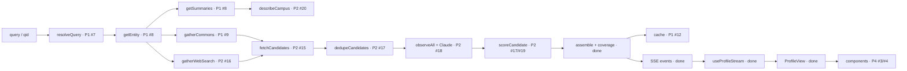

# Module map — contract-first architecture for parallel work

> Read this before touching code. It tells you **which file is yours**, **what its exact signature is**, and **how to see your work live**. Humans: see [team-workflow.md](team-workflow.md) for the day-to-day process.

## The idea in 5 lines

1. Every module of the pipeline **already exists** with its **final exported name and type**. Nobody creates architecture; everyone fills in files.
2. Unimplemented modules throw `NotImplementedError(owner, issue)` (`lib/notImplemented.ts`).
3. The orchestrator (`lib/pipeline/orchestrator.ts`) runs every stage anyway. A stage that isn't implemented is reported honestly as `skipped` (and no unscored photo is ever shown). So `/search?q=KBTU` works end-to-end **today** and lights up as each lane merges. Integration is continuous, not a big bang at 16:00.
4. All modules are injected through `lib/pipeline/deps.ts` using the types exported by each lane. If anyone changes a signature, `npm run typecheck` fails in CI, so contracts can't drift silently.
5. UI components already exist with **final props** and render plain-text placeholders from real data. P4 replaces the look; P1's container wiring stays untouched.

## Data flow

## Who implements what

Status: ✅ done (harden only if your issue says so) · 🧩 stub with final signature · 📝 draft.

### P1 · Pipeline & integration
| File | Export | Signature | Issue | Status |
|---|---|---|---|---|
| `lib/resolver/normalize.ts` | `normalizeQuery`, `queryVariants` | `(query) => string` / `string[]` | #7 | 🧩 |
| `lib/resolver/wikidata.ts` | `searchWikidata` | `(query, signal) => Promise<CandidateCard[]>` | #7 | 🧩 |
| `lib/resolver/resolve.ts` | `resolveQuery` | `(query, signal) => Promise<ResolveResult>` | #7 → #14 | 🧩 |
| `lib/resolver/indexSearch.ts` | `searchIndex` | `(query) => { entry, score }[]` | #14 | 🧩 |
| `lib/sources/wikidata.ts` | `getEntity` | `(qid, signal) => Promise<EntityDetails>` | #8 | 🧩 |
| `lib/sources/wikipedia.ts` | `getSummaries` | `(entity, signal) => Promise<WikipediaSummary[]>` | #8 | 🧩 |
| `lib/sources/commons.ts` | `gatherCommons` | `(entity, ctx) => Promise<CommonsGatherResult>` | #9 | 🧩 |
| `lib/cache/profileCache.ts` | `getCachedProfile`, `saveProfile` | `(qid) => Promise<Profile \| null>` / `(profile) => Promise<void>` | #12 | 🧩 |
| `lib/cache/ratelimit.ts` | `allowFreshRun` | `(clientKey) => Promise<{ allowed, reason? }>` | #13 | 🧩 |
| `lib/pipeline/orchestrator.ts` | `runProfilePipeline` | `(input, deps, emit, signal) => Promise<Profile \| null>` | #10 | ✅ skeleton — harden per issue |
| `lib/pipeline/{context,deadline,events,coverage,assemble,deps}.ts` | plumbing | — | — | ✅ |
| `lib/client/profileStream.ts`, `hooks/useProfileStream.ts` | reducer + hook | — | #11 | ✅ |
| `components/containers/ProfileView.tsx`, `app/search`, `app/u/[qid]` | page wiring | — | #11 | ✅ wired |
| `app/api/{resolve,profile/stream,profile/[qid]}` | routes | — | — | ✅ final (logic lives in lib) |
| `lib/sources/wikimediaFetch.ts`, `lib/sources/geo.ts` | helpers | — | — | ✅ |

### P2 · Verification
| File | Export | Signature | Issue | Status |
|---|---|---|---|---|
| `lib/images/canonicalize.ts` | `canonicalizeImageUrl` | `(url) => string` | #15 | 🧩 |
| `lib/images/safeFetch.ts` | `safeFetchImage` | `(url, signal) => Promise<SafeFetchResult>` | #15 | 🧩 |
| `lib/images/dhash.ts` | `computeDHash`, `hammingDistance` | `(image) => Promise<string>` / `(a, b) => number` | #15 | 🧩 |
| `lib/images/prepare.ts` | `prepareImage` | `(image) => Promise<PreparedImage>` | #15 | 🧩 |
| `lib/images/fetchAll.ts` | `fetchCandidates` | `(candidates, ctx) => Promise<{ fetched, failed }>` | #15 | 🧩 |
| `lib/images/dedup.ts` | `dedupeCandidates` | `(items) => { kept, rejected }` | #17 | 🧩 |
| `lib/sources/webSearch/serper.ts` | `serperProvider` | `WebImageSearchProvider` | #16 | 🧩 |
| `lib/sources/webSearch/queryPlan.ts` | `planQueries` | `(entity) => SearchQuery[]` | #16 | 🧩 |
| `lib/sources/webSearch/index.ts` | `gatherWebSearch` | `(entity, ctx) => Promise<Candidate[]>` | #16 | 🧩 |
| `lib/sources/classifyDomain.ts` | `classifyDomain` | `(hostname, entity) => DomainClass` | #16 | 🧩 |
| `lib/vision/claude.ts` | `createClaudeVisionProvider` | `() => VisionProvider` | #18 | 🧩 |
| `lib/vision/schema.ts` | `parseVisionObservations` | `(raw) => VisionObservation[]` | #18 | 🧩 |
| `lib/vision/observeAll.ts` | `observeAll` | `(items, context, provider, ctx, onBatch?) => Promise<Map>` | #18 | 🧩 |
| `lib/scoring/score.ts` | `scoreCandidate` | `(candidate, observation \| null, context) => ScoreResult` | #17 → #19 | 🧩 |
| `lib/describe/description.ts` | `describeCampus` | `(input, signal) => Promise<Description \| null>` | #20 | 🧩 |
| `lib/config/{categories,domains,limits}.ts` | config | — | — | ✅ extend freely |

### P3 · Data & evaluation (Python)
| File | What | Issue | Status |
|---|---|---|---|
| `scripts/python/spike_*.py` | spikes S2, S3, S4 | #21, #22 | 🧩 |
| `lib/vision/prompt.ts` | `VISION_SYSTEM_PROMPT`, `VISION_OUTPUT_JSON_SCHEMA` (template literals, no `${}`) | #23 | 📝 v0 |
| `scripts/python/build_index.py` → `data/universities.min.json` | `UniversityIndexEntry[]` | #24 | 🧩 |
| `scripts/python/{label_sheet,eval_run}.py` → `eval/` | labels + metrics | #25 | 🧩 |

### P4 · UI & product
| File | Props (final) | Issue | Status |
|---|---|---|---|
| `components/profile/TierBadge.tsx` | `{ tier, className? }` | #3 | 🧩 |
| `components/profile/PhotoCard.tsx` | `{ photo, onOpen? }` | #3 | 🧩 |
| `components/profile/CategorySection.tsx` | `{ category, photos, coverage, onOpenPhoto? }` | #3 | 🧩 |
| `components/profile/FilterBar.tsx` | `{ value, onChange, counts }` | #3 | 🧩 (works, unstyled) |
| `components/search/SearchBox.tsx` | `{ defaultValue?, loading?, examples?, onSubmit }` | #3 | 🧩 |
| `components/profile/EvidenceDialog.tsx` | `{ photo, open, onOpenChange }` | #4 | 🧩 |
| `components/profile/CoveragePanel.tsx` | `{ coverage, onShowUnconfirmed? }` | #4 | 🧩 |
| `components/profile/ProfileHeader.tsx` | `{ entity, facts, startedAt, finishedMs, cached, generatedAt?, originalTotalMs?, distanceToCityCenterM?, onRefresh? }` | #4 | 🧩 |
| `components/profile/PipelineRail.tsx` | `{ stages, sources }` | #4 | 🧩 |
| `components/profile/DegradedBanner.tsx` | `{ degraded }` | #4 | 🧩 |
| `components/profile/DescriptionBlock.tsx` | `{ description, ready }` | #4 | 🧩 |
| `components/search/PickList.tsx`, `NotFound.tsx` | `{ query, candidates \| suggestions, onPick }` | #4 | 🧩 |
| `components/profile/FilteredOutTray.tsx` | `{ items }` | #27 | 🧩 |
| `lib/ui/filters.ts` | `applyFilters`, `toggleCategory`, `DEFAULT_FILTERS` | — | ✅ |
| `app/page.tsx`, `app/how-it-works/page.tsx` | pages | #5 | 📝 plain form |

## How to implement a stub

1. Keep the exported **name** and **type**. Either keep the typed const or switch to a function declaration that matches the type: `export const x: X = …` or `export async function x(...): ReturnType<X>`.
2. Replace the `notImplemented(...)` call with real code. Pass the `AbortSignal` to every `fetch`. Take timeouts from `lib/config/limits.ts`.
3. Add vitest tests in `tests/`.
4. Run `npm run check`.
5. Nothing to wire: `lib/pipeline/deps.ts` already imports your module, so the running pipeline picks it up immediately.

## Contract changes (`lib/types.ts`, signatures, `package.json`)

1. Open an issue with the label `contract-change`.
2. Ping P1 and the lane that consumes the contract.
3. Make one small PR that changes the type **and all call sites**, and merge it fast.

Never change a signature silently: other people's agents are coding against it right now.

## See your work live

| What | Where |
|---|---|
| Real pipeline (source chips show skipped/ok) | `npm run dev` → http://localhost:3000/search?q=KBTU |
| Realistic UI data without backend (dev/preview only) | http://localhost:3000/search?q=demo&replay=1 · http://localhost:3000/dev/fixtures |
| Outage simulation | add `&simulate=web_search_down,vision_down,wikimedia_down` |
| Orchestrator contract tests | `npx vitest tests/pipeline.test.ts` |
| Production | https://campusproof.vercel.app (`/api/health`) |
