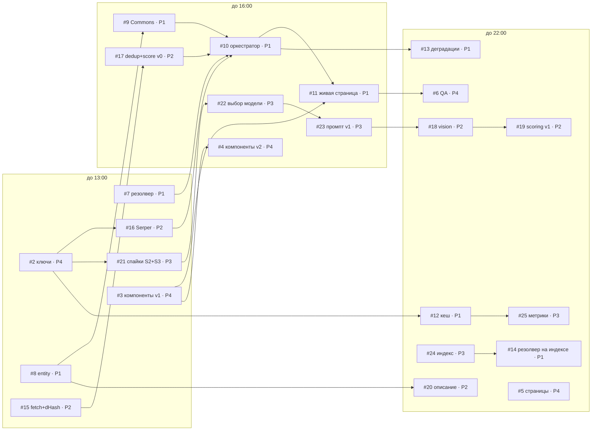

# План на четверг, 17 сентября — направление B «Proof, Not Pictures»

> Для всей команды из 4 человек. Собран из [case-analysis](case-analysis.md), [product-strategy](product-strategy.md), [architecture](architecture.md) и [roadmap](roadmap.md).
> Время — **Астана**. Старт дня **T0 = 10:00**, поэтому T+3 = 13:00, T+6 = 16:00, T+9 = 19:00, T+12 = 22:00.
> Трекер дня: [issue #1](https://github.com/Amir10202010/campusproof/issues/1). Все задачи: [issues](https://github.com/Amir10202010/campusproof/issues).

---

## 0. Коротко

- **Цель дня:** к **22:00** на проде работает MVP. Поиск → профиль за <30 с для 10 вузов, у фото есть уровни достоверности, источники, даты, 5 разделов и 4 фильтра, а также диалог «почему мы доверяем фото».
- **Роли:** P1 — Pipeline (сильный вайбкодер, владелец GitHub и Vercel), P2 — Verification (сильный вайбкодер), P3 — Data & Eval (Python), P4 — UI & Product (вайбкодер-новичок). Подробности в §2.
- **Контрольные точки:**

  | Время | Что должно быть |
  |---|---|
  | **13:00** | Первые реальные данные |
  | **16:00** | Пайплайн v0 от запроса до профиля |
  | **19:00** | Vision (AI-проверка фото) встроен в пайплайн |
  | **22:00** | MVP на проде |

- **Параллельность:** контракты, фикстуры и заглушки уже есть, поэтому **в 10:00 все четверо начинают сразу**, никто никого не ждёт. Пути пересекаются в 15:00–16:00 и в 19:00 (§6).
- **Один репозиторий на всех**, работа через ветки и PR. Каждый PR автоматически получает превью-ссылку Vercel.

---

## 1. Что уже сделано (16.09, вечер)

| Что | Где |
|---|---|
| Публичный репозиторий | https://github.com/Amir10202010/campusproof |
| Next.js 16.3 + TypeScript + Tailwind 4 + shadcn/ui (Radix) + все нужные npm-пакеты | корень репо; **новые пакеты не добавлять без P1** |
| Контракты данных (типы для всех ролей) | `lib/types.ts` |
| Категории с формулировками из кейса, списки доменов, лимиты и пороги | `lib/config/*` |
| Правила для AI-ассистентов (Claude Code и Cursor читают их сами) | `AGENTS.md`, `CLAUDE.md` |
| Фикстура профиля и стрим-реплей для разработки UI без бэкенда | `fixtures/*`, `/dev/fixtures`, `/api/dev/replay` (только dev и превью) |
| Заглушки API в нужных местах | `/api/resolve`, `/api/profile/stream`, `/api/profile/[qid]` |
| Проверка здоровья и диагностика стрима и sharp на Vercel | `/api/health`, `/api/dev/sse-check` |
| Обёртка для Wikimedia с обязательным User-Agent | `lib/sources/wikimediaFetch.ts` |
| Черновик vision-промпта и JSON-схемы, общий для TS и Python | `lib/vision/prompt.ts` |
| Python-скелет: спайки, индекс, разметка, метрики | `scripts/python/*` |
| CI (typecheck + lint + тесты) и шаблон PR | `.github/*` |
| 31 задача с чеклистами, метками владельцев, майлстоунами и стартовыми промптами для AI | [issues](https://github.com/Amir10202010/campusproof/issues), [milestones](https://github.com/Amir10202010/campusproof/milestones) |
| Продакшен на Vercel (регион fra1) | _появится после подключения Vercel — см. §3.4_ |

---

## 2. Роли: кто есть кто

| Роль | Кто | Почему именно так | Главный результат дня |
|---|---|---|---|
| **P1 · Pipeline** | Сильный вайбкодер №1. **Рекомендация: Амир** (владелец GitHub и Vercel) | Самая связная работа: оркестратор, стриминг, дедлайны, склейка всех частей. На Vercel Hobby нет участников команды: env-переменные, логи и настройки деплоя видит только владелец. Поэтому интегратор — владелец | Живой профиль на проде, кеш, деградации |
| **P2 · Verification** | Сильный вайбкодер №2 | Самая «умная» логика: безопасная загрузка картинок, хеши, дедупликация, Claude vision, скоринг. От неё зависит точность, это 30% оценки | Фото с честными уровнями и доказательствами |
| **P3 · Data & Eval** | Python-разработчик | Работа изолирована от TypeScript: скрипты общаются с приложением только через JSON-файлы и HTTP API. Ошибка в скрипте не ломает сайт | Решения по данным и модели, индекс вузов, первые метрики |
| **P4 · UI & Product** | Вайбкодер-новичок | Презентационные компоненты на фикстурах — самый безопасный вайбкодинг: результат сразу видно, нет асинхронщины, API и инфраструктуры. Плюс продуктовые задачи, где важна аккуратность, а не опыт | Все экраны профиля + QA-прогон |

**Пары взаимопомощи:**
- **P1 ↔ P4:** P1 ревьюит PR от P4 в течение 20 минут и подключает компоненты к живым данным.
- **P2 ↔ P3:** выбор модели, промпт, пороги скоринга по разметке.

**P4 не трогает** `app/api/**`, `lib/pipeline/**`, `lib/vision/**`, `lib/scoring/**`. Если нужно что-то оттуда, пишет владельцу.

---

## 3. GitHub и Vercel: что создано и как работаем

### 3.1 Сколько репозиториев создавать
**Один, и он уже создан.** Не заводите репо на каждого человека: жюри нужен один репозиторий с общей историей разработки, а Vercel деплоит один проект. Python-скрипты живут в том же репо (`scripts/python`).

### 3.2 Доступ для команды (Амир, 5 минут утром)
Пригласить троих по их GitHub-никам: Settings → Collaborators → Add people, или командой:
```bash
gh api -X PUT repos/Amir10202010/campusproof/collaborators/GITHUB_NICK -f permission=push
```
Каждый принимает приглашение и выполняет:
```bash
git clone https://github.com/Amir10202010/campusproof.git
```
```bash
cd campusproof && npm install && cp .env.example .env.local && npm run dev
```
После этого открыть http://localhost:3000/dev/fixtures. P3 дополнительно настраивает Python по `scripts/python/README.md`.

### 3.3 Как работаем с кодом
- **Ветка на задачу:** `p1/resolver`, `p2/dhash`, `p3/spikes`, `p4/photo-card`. PR маленькие, до ~400 строк.
- **Перед PR:** `npm run check`. В PR ссылка на issue (`Closes #7`).
- **PR:** CI зелёный → открыть превью-ссылку Vercel из PR → 1 ревью → squash merge.
  - P1 ↔ P2 ревьюят друг друга.
  - P1 ревьюит P4.
  - P2 ревьюит TS-изменения P3.
- **В `main` напрямую не пушим** (кроме хотфиксов P1). `main` всегда рабочий, потому что это прод.
- **`lib/types.ts` и `package.json` меняем только через P1.** От них зависят все.
- **Коммитим со своего аккаунта и часто.** Организаторы могут смотреть историю Git.

**Метки задач:**

| Метка | Значение |
|---|---|
| `P1 · pipeline` / `P2 · verification` / `P3 · data-python` / `P4 · ui-product` | Владелец |
| `must` | Без этого нет MVP |
| `integration` | Стык между ролями |
| `B-layer` | Слой B, пятница |
| `blocked` | Задача заблокирована |

**Майлстоуны:** T+3 · 13:00 → T+6 · 16:00 → T+12 · 22:00 → Пятница.

### 3.4 Vercel
- **Проект:** `campusproof` у Амира. Регион `fra1` (задан в `vercel.json`).
- **Автодеплой:** `main` → продакшен, каждый PR → превью. Репо публичный, поэтому превью работают для коммитов всех участников. На Vercel Hobby это возможно только с публичным репо.
- **Env-переменные** задаёт Амир в Settings → Environment Variables (Production + Preview). Список — в `.env.example`.
- **Логи функций** видит только Амир. Упало на превью — присылайте ему ссылку и время.

### 3.5 Ключи
- Ключи никогда не пишем в чат, issues, PR или код. Только в свой `.env.local` (он в `.gitignore`) и в Vercel env.
- Владелец ключа передаёт его каждому **лично**.

---

## 4. Расписание дня

| Время | Все |
|---|---|
| 10:00–10:30 | **Кикофф:** каждый читает свои issues (5 мин); P4 и Амир заводят ключи ([#2](https://github.com/Amir10202010/campusproof/issues/2)); остальные клонируют репо и запускают `npm run dev` |
| 10:30–13:00 | Блок 1 |
| **13:00–13:15** | **Синк T+3**: что готово, выводы спайков S2/S3 от P3 |
| 13:15–13:45 | Обед |
| 13:45–16:00 | Блок 2 |
| **16:00–16:15** | **Синк T+6**: живой профиль Nazarbayev University на превью; решение по vision-модели |
| 16:15–19:00 | Блок 3 |
| **19:00–19:10** | **Синк T+9**: vision в пайплайне? индекс готов? |
| 19:10–19:40 | Ужин |
| 19:40–22:00 | Блок 4 |
| **22:00–22:20** | **Синк T+12**: демо MVP на проде, первые метрики, распределение задач на пятницу |
| до 23:30 | Только фиксы по итогам синка. **Стоп в 23:30, спать** |

> Если у кого-то занятия днём: пусть берёт задачи, которые никого не блокируют (P3 — S2 и индекс, P4 — компоненты), и сообщит время подключения до 10:00. Синки не переносим.

---

## 5. Что должно быть готово через 3 / 6 / 12 часов

### ✅ T+3 — 13:00 «Первые реальные данные»

| Кто | Готово | Как проверить |
|---|---|---|
| **P4** | [#2](https://github.com/Amir10202010/campusproof/issues/2) ключи Anthropic (с лимитом трат) и Serper у P2/P3, env в Vercel · [#3](https://github.com/Amir10202010/campusproof/issues/3) компоненты v1: `TierBadge`, `PhotoCard`, `CategorySection`, `FilterBar`, `SearchBox` | `/api/health` → `configured` = true; `/dev/fixtures` на превью похож на профиль |
| **P1** | [#7](https://github.com/Amir10202010/campusproof/issues/7) `/api/resolve` через Wikidata (resolved / ambiguous / not_found) · [#8](https://github.com/Amir10202010/campusproof/issues/8) `getEntity` + Wikipedia · первые цифры Commons | `curl "<превью>/api/resolve?q=MSU"` → ambiguous; `KBTU` → resolved |
| **P2** | [#15](https://github.com/Amir10202010/campusproof/issues/15) safe fetch + канонизация + dHash + тесты · [#16](https://github.com/Amir10202010/campusproof/issues/16) Serper-адаптер возвращает `Candidate[]` | `npm test` зелёный; скрипт на 3 KZ-вуза отдаёт кандидатов |
| **P3** | [#21](https://github.com/Amir10202010/campusproof/issues/21) спайки S2 (Commons) и S3 (Serper) → `docs/spikes.md` с выводами | Таблицы S2/S3 в main, выводы озвучены на синке |

### ✅ T+6 — 16:00 «Пайплайн v0 от запроса до профиля»

| Кто | Готово | Как проверить |
|---|---|---|
| **P1** | [#9](https://github.com/Amir10202010/campusproof/issues/9) Commons-адаптер · [#10](https://github.com/Amir10202010/campusproof/issues/10) оркестратор + SSE с дедлайном 27 с · [#11](https://github.com/Amir10202010/campusproof/issues/11) `useProfileStream` + `/u/[qid]` | `/u/<qid NU>` на превью строит профиль вживую, пока без AI-уровней |
| **P2** | [#17](https://github.com/Amir10202010/campusproof/issues/17) дедуп L1/L2 + scoring v0 (не-визуальные сигналы) смержены и подключены P1 | Тесты зелёные; в профиле нет точных дублей |
| **P3** | [#22](https://github.com/Amir10202010/campusproof/issues/22) выбор vision-модели на 40 размеченных картинках · [#23](https://github.com/Amir10202010/campusproof/issues/23) промпт v1 | Таблица моделей в `docs/spikes.md`; `VISION_MODEL` обновлён в Vercel |
| **P4** | [#4](https://github.com/Amir10202010/campusproof/issues/4) `EvidenceDialog`, `CoveragePanel`, `ProfileHeader` с таймером, `PipelineRail`, `DegradedBanner`, `PickList` / `NotFound` + страница `/dev/stream` на реплее | На превью `/dev/stream` показывает весь путь от этапов до финала |

### ✅ T+9 — 19:00 (короткий синк)
- **P2:** [#18](https://github.com/Amir10202010/campusproof/issues/18) vision-модуль встроен — фото приходят с наблюдениями модели.
- **P3:** [#24](https://github.com/Amir10202010/campusproof/issues/24) `data/universities.min.json` в main (≥300 вузов KZ и Центральной Азии).
- **P1:** [#12](https://github.com/Amir10202010/campusproof/issues/12) кеш Upstash и `/api/profile/[qid]` работают. Это нужно P3 для разметки.

### ✅ T+12 — 22:00 «MVP на проде»

| Кто | Готово |
|---|---|
| **P1** | [#12](https://github.com/Amir10202010/campusproof/issues/12) кеш + бейдж «сохранённый профиль» · [#13](https://github.com/Amir10202010/campusproof/issues/13) деградации + `?simulate=` + лимиты · [#14](https://github.com/Amir10202010/campusproof/issues/14) резолвер на индексе + расстояние до центра |
| **P2** | [#19](https://github.com/Amir10202010/campusproof/issues/19) scoring v1 с визуальными сигналами и причинами отбраковки · [#20](https://github.com/Amir10202010/campusproof/issues/20) описание кампуса с цитатами |
| **P3** | [#25](https://github.com/Amir10202010/campusproof/issues/25) разметка ≥8 вузов (tune/test) + первые метрики в `eval/results/2026-09-17.md` |
| **P4** | [#5](https://github.com/Amir10202010/campusproof/issues/5) главная + `/how-it-works` + мобильная версия 375 px · [#6](https://github.com/Amir10202010/campusproof/issues/6) QA-прогон 15 запросов на проде → баги в issues |

**Общий критерий 22:00:** 10 вузов из матрицы (`docs/roadmap.md` §9) на проде, медиана < 30 с, в «Проверено» нет очевидно чужих фото.

---

## 6. Что делается параллельно

### 6.1 С 10:00 стартуют без ожидания
| Кто | Задача | Почему не ждёт |
|---|---|---|
| P1 | #7 резолвер, #8 entity | Wikimedia не требует ключей |
| P2 | #15 fetch + dHash | Тесты на картинках, сгенерированных sharp |
| P3 | #21 S2 (Commons) | Ключи не нужны; S3 — как только P4 даст ключ Serper |
| P4 | #2 ключи → #3 компоненты | Компоненты строятся на `fixtures/profile.sample.ts` |

### 6.2 Схема зависимостей



### 6.3 Передачи между людьми
| Когда | От → кому | Что | Где |
|---|---|---|---|
| 10:30 | P4 → P2, P3 | Ключи Serper и Anthropic | Лично → `.env.local` |
| 13:00 | P3 → P2 | Какие шаблоны запросов и домены работают (S3) | `docs/spikes.md` |
| 13:00 | P3 → P1 | Сколько фото реально даёт Commons (S2) | `docs/spikes.md` |
| ~15:00 | P2 → P1 | `lib/images/*`, `dedup`, `score` v0 | PR в main |
| ~15:00 | P4 → P1 | Компоненты v1 и их props | PR в main |
| 16:00 | P3 → P2 | Выбранная модель + промпт v1 | `docs/spikes.md`, `lib/vision/prompt.ts` |
| 16:00 | P3 → Амир | Значение `VISION_MODEL` | Vercel env |
| 19:00 | P1 → P3 | `/api/profile/[qid]` на проде | Для разметки и метрик |
| 19:00 | P3 → P1 | `data/universities.min.json` | PR в main |
| 21:00 | P4 → P1, P2 | Баги QA-прогона | Issues с меткой `bug` |

### 6.4 Как не мешать друг другу
- **Свои папки.** Карта владения — в `AGENTS.md`. Чужой файл — только после сообщения владельцу.
- **Пока соседа нет, работайте на контракте.**
  - P1 подключает временные функции с теми же сигнатурами, что будут у P2 (на реальных данных, без фейковых событий).
  - P4 рендерит фикстуры.
  - P2 до промпта v1 работает на черновике v0.
- **Один общий файл — один владелец:** `lib/types.ts` (P1), `lib/config/categories.ts` (P2), `fixtures/*` (P4).

---

## 7. Первые 30 минут каждого

| Кто | Что сделать |
|---|---|
| **P1 (Амир)** | Пригласить collaborators (§3.2) · проверить `/api/health` и `/api/dev/sse-check?seconds=25` на проде (стрим идёт без буферизации?) · вместе с P4 завести env в Vercel |
| **P2** | Клонировать репо → `npm run dev` · прочитать `docs/architecture.md` §5.2–5.6 · открыть #15 и отдать AI стартовый промпт из issue |
| **P3** | Клонировать репо → venv по `scripts/python/README.md` · прочитать docstring `spike_commons_yield.py` · открыть #21 и отдать AI стартовый промпт |
| **P4** | С Амиром и взрослым владельцем карты сделать #2 (Anthropic с лимитом трат, Serper, Upstash) · затем открыть `/dev/fixtures` и #3 |

**Как работать с AI-ассистентом:** в начале каждой сессии скажите ему «Прочитай AGENTS.md и issue #N». Дальше давайте стартовый промпт из issue. Claude Code читает `CLAUDE.md` сам, Cursor — `AGENTS.md`.

---

## 8. Если что-то пошло не так (правила отсечения на четверг)

| Когда | Если | Делаем |
|---|---|---|
| 10:45 | Нет ключа Anthropic (нет карты или взрослого) | P3 делает S2/S3, P2 — #15/#16/#17. Vision (#18) и S4 (#22) ждут ключа. Если к 13:00 ключа нет, обсуждаем запасной провайдер (architecture §2) |
| 13:00 | `/api/resolve` не работает на превью | P2 на 30 минут помогает P1; P4 и P3 продолжают |
| 16:00 | Нет живого профиля Nazarbayev University | P1 + P2 парой чинят оркестратор; P4 переходит к #5; P3 продолжает |
| 16:00 | S4 не закончен | P2 берёт `claude-opus-5` с effort low по умолчанию; S4 доделываем до 19:00 |
| 19:00 | Vision не встроен | Профиль на не-визуальных сигналах + честный баннер «визуальная проверка недоступна»; vision — первым делом в пятницу |
| 19:00 | Индекс не готов | Резолвер остаётся на живом Wikidata + маленький файл алиасов; индекс утром в пятницу |
| 21:30 | Медиана > 30 с | Уменьшить до 24 картинок на vision и 6 поисковых запросов, картинки 512 px |
| 23:30 | Что угодно | Стоп. Сон важнее: в пятницу freeze в 19:00 и запись видео |

**Нельзя в любой ситуации:**
- подгонять код под конкретный вуз;
- показывать фейковый прогресс;
- подкручивать уровни руками;
- коммитить ключи.

---

## 9. Чеклист конца дня (22:00)

- [ ] На проде: поиск → профиль для 10 вузов из матрицы, медиана < 30 с
- [ ] Уровни «Проверено / Вероятно / Не подтверждено» считаются кодом из наблюдений модели и сигналов
- [ ] 5 обязательных разделов и 4 фильтра; у каждой карточки есть источник и дата с типом
- [ ] Диалог доказательств, панель покрытия, описание с цитатами
- [ ] Кеш с честным бейджем; `?simulate=web_search_down` даёт профиль с баннером
- [ ] Первые метрики в `eval/results/2026-09-17.md`
- [ ] Все PR смержены, `main` зелёный, трекер [#1](https://github.com/Amir10202010/campusproof/issues/1) отмечен
- [ ] Владельцы задач на пятницу назначены (#26–#31)

---

## 10. Что будет в пятницу (для ориентира)

Утро — слои B:
- [#26](https://github.com/Amir10202010/campusproof/issues/26) reuse-детектор;
- [#27](https://github.com/Amir10202010/campusproof/issues/27) лоток «Отфильтровано»;
- [#28](https://github.com/Amir10202010/campusproof/issues/28) карта;
- [#29](https://github.com/Amir10202010/campusproof/issues/29) линза «официальные vs независимые»;
- [#30](https://github.com/Amir10202010/campusproof/issues/30) `/benchmark`.

**Freeze в 19:00.** Вечером запись видео с прода, README и презентация ([#31](https://github.com/Amir10202010/campusproof/issues/31)). Перед сдачей удалить `app/api/dev/sse-check` (диагностика). Сдача в субботу до 10:30.
