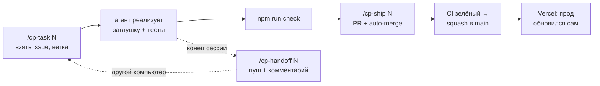

# Как работаем вчетвером с разных компьютеров и с AI-агентами

> Регламент команды. Технический контракт — в [module-map.md](module-map.md), правила для агентов — в [`AGENTS.md`](../AGENTS.md), план дня — в [plan-thursday.md](plan-thursday.md).

## 0. Правила на одной странице

1. **Один репозиторий, `main` защищён.** Код попадает в `main` только через PR с зелёным CI (job `check`). После зелёного CI PR сливается сам (auto-merge, squash). `main` всегда рабочий, это прод.
2. **Одна задача = одна ветка = один PR** (до ~400 строк). Ветка живёт часы, а не дни.
3. **Архитектура уже есть.** Каждый модуль и компонент существует как заглушка с финальной сигнатурой, вы «заполняете» свой файл. Пайплайн уже работает сквозняком и подхватывает вашу реализацию автоматически.
4. **Свои файлы.** Каждый меняет только файлы своей полосы (карта в [module-map.md](module-map.md)). `lib/types.ts` и `package.json` меняются только через P1 (issue с меткой `contract-change`).
5. **Состояние — в GitHub, а не в голове или на ноутбуке.**
   - Взял задачу → назначил себя на issue.
   - Закончил сессию → запушил ветку и написал handoff-комментарий.
   - Другой человек или агент на другом компьютере продолжит ровно с этого места.
6. **Агент никогда:**
   - не читает `.env*`;
   - не делает force-push и не пушит в `main`;
   - не добавляет «особые случаи» под конкретный вуз;
   - не подделывает прогресс или баллы.

   Часть этого уже запрещена в `.claude/settings.json` и защитой ветки.

---

## 1. Настройка компьютера (один раз, ~15 минут)

| Шаг | Команда / действие |
|---|---|
| Node 24 | `nvm install && nvm use` (версия в `.nvmrc`) |
| Git-имя и почта **как в вашем GitHub-аккаунте** | `git config --global user.name "…"` и `git config --global user.email "…"` |
| GitHub CLI | `gh auth login` |
| Код | `gh repo clone Amir10202010/campusproof && cd campusproof && npm ci` |
| Ключи | `cp .env.example .env.local` → вставить ключи, которые владелец передал **лично** |
| Проверка | `npm run check` и `npm run dev` → http://localhost:3000/search?q=demo&replay=1 |
| AI-агент | Claude Code: запустить `claude` в папке репо — он сам прочитает `CLAUDE.md` → `AGENTS.md` и увидит команды `/cp-*`. Cursor читает `AGENTS.md` сам |
| Windows | Лучше через WSL. Переводы строк выравнивает `.gitattributes` |
| Python (только P3) | `scripts/python/README.md` |

---

## 2. Цикл работы над задачей



**В Claude Code:**
```
/cp-task 15
```
Агент читает issue и карту модулей, назначает вас, создаёт ветку `p2/…` от свежего `main`, реализует, пишет тесты и гоняет `npm run check`. Затем:
```
/cp-ship 15
```
Агент подтягивает `main`, форматирует, коммитит, пушит, создаёт PR `Closes #15` и включает auto-merge. Через ~2 минуты в PR появится превью Vercel.

**В Cursor и других агентах:** скажите «Прочитай `AGENTS.md` и `.claude/skills/cp-task/SKILL.md` и выполни эти шаги для issue #15».

---

## 3. Команды агента (Claude Code)

| Команда | Что делает | Когда |
|---|---|---|
| `/cp-task <N>` | Назначает issue, создаёт ветку, реализует по контракту, тестирует | Начало работы над задачей |
| `/cp-ship <N>` | Rebase на `main` → `fix` → `check` → коммит → PR (Closes #N) → auto-merge | Задача готова |
| `/cp-sync` | Подтягивает `main` и разрешает конфликты по правилам владения | Утром, после чужих мержей, «branch out of date» |
| `/cp-handoff <N>` | Пушит ветку и пишет в issue: статус, что сделано, что осталось, как проверить | Конец сессии, обед, смена компьютера |
| `/cp-review <PR>` | Ревью PR тиммейта: честность, контракты, владение, надёжность, тесты | Когда вас попросили посмотреть PR |
| `/cp-standup` | Сводка по майлстоунам, PR, CI и блокерам + какое правило отсечения применить | На синках 13:00 / 16:00 / 19:00 / 22:00 |

---

## 4. Несколько агентов на одном компьютере

Один агент = одна папка = одна задача. Не запускайте двух агентов в одной папке: они будут перетирать файлы друг друга. Используйте `git worktree`:
```bash
git worktree add ../campusproof-p2-dedup -b p2/dedup origin/main
```
```bash
cd ../campusproof-p2-dedup && npm ci && cp ../campusproof/.env.local . && PORT=3001 npm run dev
```
После мержа PR:
```bash
git worktree remove ../campusproof-p2-dedup
```

---

## 5. Как не конфликтовать

| Ситуация | Правило |
|---|---|
| Нужен общий файл | Скорее всего, он уже есть как заглушка. Проверьте `module-map.md` |
| Хочу поменять тип или сигнатуру | Issue `contract-change` → P1 → маленький PR сразу со всеми местами вызова |
| Нужен npm-пакет | Спросить P1. Пакеты ставит только P1, одним PR |
| Конфликт в `package-lock.json` | Взять версию из `main` → `npm ci` |
| Конфликт в чужом файле | Взять версию из `main`: владелец прав |
| Конфликт в `lib/types.ts` | Сохранить поля обеих сторон; если противоречат — к P1 |
| PR висит дольше часа | Дробить или просить ревью в чате. Большие долгие PR — главный источник конфликтов |
| Две машины, одна задача | Проверить assignee в issue. Если кто-то назначен — сначала написать ему |

---

## 6. Ключи, окружение, деплой

- **Ключи** живут только в `.env.local` на каждой машине и в Vercel env. Никогда не пишите их в чат, issues или PR. Передавайте лично.
- **Vercel (Hobby)** принадлежит Амиру: env-переменные, логи функций и откаты видит только он. `.env.local` у Амира содержит `VERCEL_OIDC_TOKEN` — не передавать.
- **Деплой:** мерж в `main` → прод https://campusproof.vercel.app обновится сам (~1 мин). Каждый PR получает превью-ссылку.
- **Превью закрыты логином Vercel** (по умолчанию). Пока Амир не отключит защиту превью, остальные проверяют UI локально через `npm run dev`.
- **Сломали прод:**
  1. Кнопка **Revert** в смерженном PR на GitHub → новый PR → auto-merge.
  2. Срочно — Амир делает Instant Rollback в Vercel.
- **Проверка перед демо:** https://campusproof.vercel.app/api/health

---

## 7. Ревью кода от AI за 3 минуты

1. Цель PR совпадает с issue? Нет ли лишнего?
2. Файлы только из полосы автора?
3. Внешние вызовы с `AbortSignal` и таймаутом? Wikimedia только через `wikimediaFetch`?
4. Нет ли подгонки под конкретный вуз, выдуманных баллов, фейкового прогресса?
5. Есть тесты на новую логику, CI зелёный?
6. UI: открыть превью или `npm run dev`, пройти 2 запроса, посмотреть на телефоне.

Или просто `/cp-review <номер PR>`.

---

## 8. Частые проблемы

| Проблема | Решение |
|---|---|
| CI упал на `format:check` | `npm run fix` → коммит → пуш |
| `Required status check "check" is expected` | Дождаться CI или починить то, что упало |
| Агент просит доступ к `.env.local` | Отказать: секреты агенту не нужны, ключи читает сам код |
| `EventSource` бесконечно переподключается | Хук уже закрывает стрим на `done/error`. Не открывайте свой `EventSource` в компонентах |
| На странице «заглушка · P4 #…» | Это нормально: компонент ещё не сделан, данные в нём настоящие |
| Источник `skipped` в PipelineRail | Модуль ещё не реализован (см. issue в заметке источника) |
| Ветка сильно отстала | `/cp-sync` |
